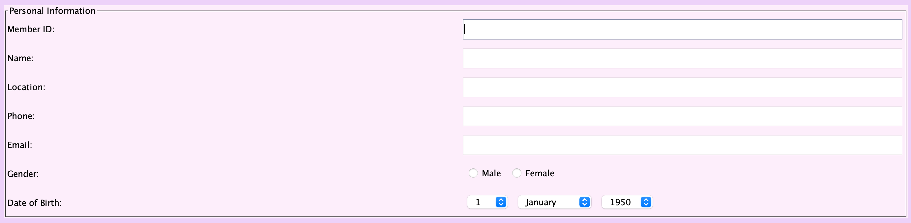
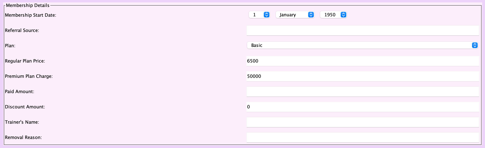
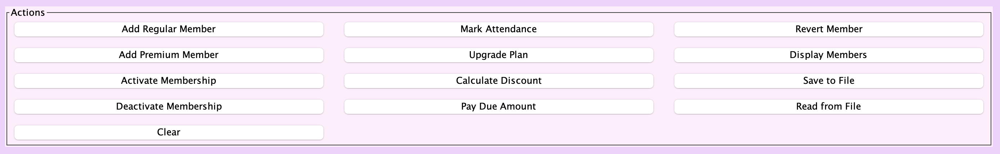
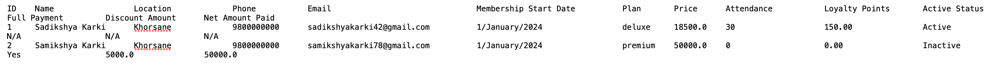

# 🏋️ Gym Membership Management System

## 📌 Overview

This is a **Java Swing-based desktop application** designed to help gym staff manage member information, membership status, and payments efficiently.  
The system supports both **Regular** and **Premium** members and stores all data in a structured text file.

---

## 🚀 Features

### 💾 Save Member Details to File
- Saves all member data to `MemberDetails.txt`
- Stores basic details for all members
- Includes additional payment details for **Premium members**:
  - Full payment status
  - Discount amount
  - Net amount paid
- Displays success/error messages

---

### 📂 Read Member Details from File
- Reads data from `MemberDetails.txt`
- Prompts file selection if file is missing
- Displays data in a formatted window (monospaced text)
- Handles errors gracefully

---

### ❌ Deactivate Membership
- Deactivates a member using their ID
- Validates input
- Shows success or error messages

---

### 💳 Pay Due Amount (Premium Members)
- Allows premium members to pay outstanding dues
- Validates:
  - Member ID
  - Payment amount
- Ensures member is **Premium**
- Updates payment records
- Displays feedback messages

---

### 🧹 Clear Input Fields
- Resets all input fields
- Clears:
  - Text fields
  - Combo boxes
  - Radio buttons

---

## ▶️ How to Use

1. Run the application  
   - Execute the `main` method in the `GymGUI` class  

2. Add or manage members  
   - Enter details using the form  

3. Save data  
   - Click **Save** button or trigger `saveToFile()`  

4. Load data  
   - Click **Load** button or use `readFromFile()`  

5. Deactivate membership  
   - Enter member ID and deactivate  

6. Process payments  
   - Enter Premium member ID and payment amount  

7. Clear inputs  
   - Click **Clear** button or use `clearFields()`  

---

## 🛠️ Technologies Used

- **Java**
- **Java Swing (GUI)**
- **File Handling (I/O)**

---

## 📁 File Structure

```
project-root/
│
├── Code/                  # Java source code + program files
│   ├── GymGUI.java        # Main GUI (Swing interface)
│   ├── GymMember.java     # Base class for members
│   ├── PremiumMember.java # Premium member logic
│   ├── RegularMember.java # Regular member logic
│   └── MemberDetails.txt  # Output file storing member data
│
├── images/                 # Application screenshots for README
│   ├── personal_info.png   # Personal information input section
│   ├── member_details.png  # Member details display section
│   ├── actions_panel.png   # Action buttons (save, load, clear, etc.)
│   └── file_output.png     # Saved data output in text file
│
└── README.md             
```

---

## 📄 Sample Output File (`MemberDetails.txt`)

```
ID    Name                 Location             Phone           Email                               Membership Start Date          Plan       Price      Attendance           Loyalty Points       Active Status        Full Payment         Discount Amount      Net Amount Paid     
1     Sadikshya Karki      Khorsane             9800000000      sadikshyakarki42@gmail.com          1/January/2024                 deluxe     18500.0    30                   150.00               Active               N/A                  N/A                  N/A                 
2     Samikshya Karki      Khorsane             9800000000      samikshyakarki78@gmail.com          1/January/2024                 premium    50000.0    0                    0.00                 Inactive             Yes                  5000.0               50000.0             

```

---

## ⚠️ Limitations

- Uses text file instead of database
- Desktop-only (no web or mobile version)
- No authentication system

---

## 📸 Application Preview

### 🧾 Personal Information Section


### 📋 Member Details Section


### ⚙️ Actions Panel


### 📄 Saved Data (Text File Output)


---

## 🧑‍💻 Author
**Sadikshya Karki**
